<p align="center">
  
</p>

<h1 align="center">Linux File Explorer</h1>

<p align="center">
  A fast, browser-based file manager for a Linux host, styled after Windows Explorer's
  Details view — full filesystem access, background copy/move/delete jobs, a proper
  Trash, permissions editing, and rich keyboard navigation.
</p>

<p align="center">
  
  
  
  
  
</p>

---

## Contents

- [Features](#features)
- [Screenshots](#screenshots)
- [Architecture](#architecture)
- [Quick start with Docker Compose](#quick-start-with-docker-compose)
- [Keyboard navigation](#keyboard-navigation)
- [Local development (without Docker)](#local-development-without-docker)
- [Troubleshooting](#troubleshooting)
- [Project layout reference](#project-layout-reference)

## Features

- **Details-view file listing** — sortable columns, Windows-style date grouping
  (Today / Yesterday / Last week / …), multi-select via click, `Shift`/`Ctrl`, or a
  mouse rubber-band drag, and a right-click context menu.
- **Full keyboard navigation** — arrows, `Shift`+arrows, `Ctrl+A`, `Enter`,
  `Backspace`, `F2`, `Delete`, `Ctrl+C`/`X`/`V`, and instant type-ahead search. See the
  [Keyboard navigation](#keyboard-navigation) section for the complete reference.
- **Durable background jobs** — copy, move, and delete run as background jobs that keep
  running even if you close the browser tab, with live progress on the **Tasks** page
  pushed over SignalR.
- **Safe deletes** — deleting moves items to a per-drive hidden Trash instead of
  removing them immediately; restore or permanently purge from the **Trash** page.
- **Drive sidebar** — left-hand drive list with free-space usage bars; the sidebar is
  resizable and its width is shared across Explorer, Tasks, and Trash.
- **Properties & permissions** — a Properties dialog shows size/type/dates, plus a
  Permissions tab to view and change owner, group, and rwx bits (`chmod`/`chown`) when
  the API runs on Linux.
- **File preview** — inline preview for images, text, PDF, audio, and video, without
  leaving the listing.
- **Recursive filename search** — search the current folder and everything beneath it.
- **JWT-based auth** — login with a change-password flow; no anonymous access.

## Screenshots

The app supports both a light and a dark theme, switchable at any time from the user
menu (**Appearance → Light/Dark**) — the choice is saved to `localStorage` and restored
on your next visit.

| | Light | Dark |
|---|---|---|
| **Login** | 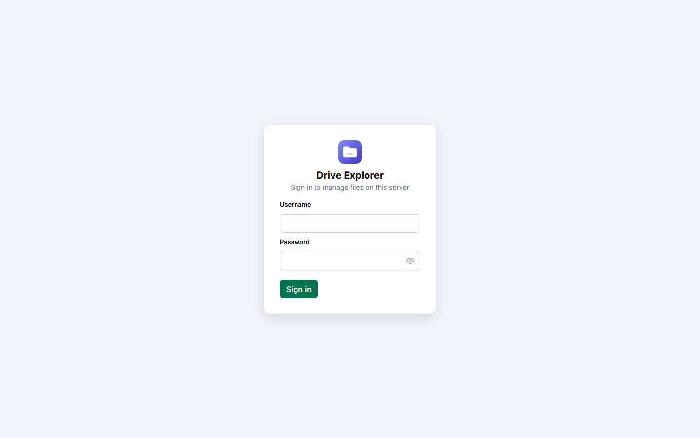 | 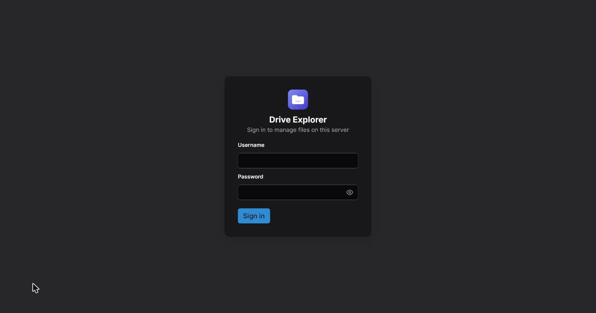 |
| **Explorer — Details view** | 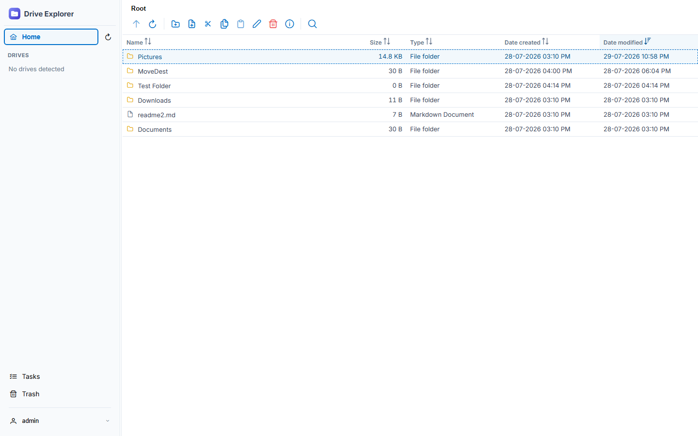 | 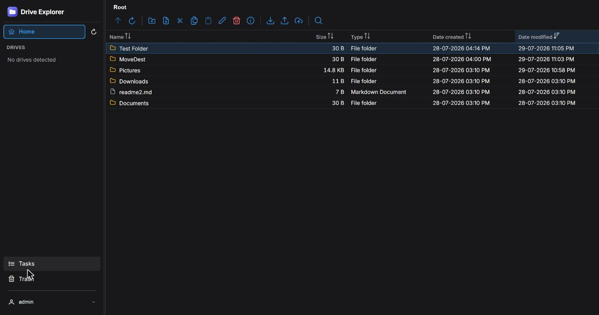 |
| **Right-click context menu** | 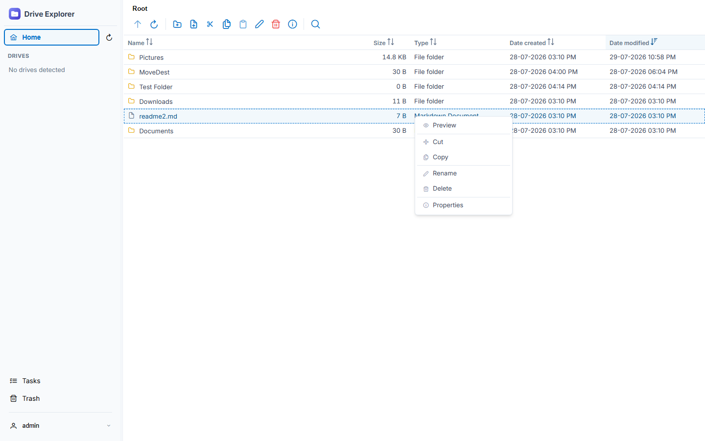 | 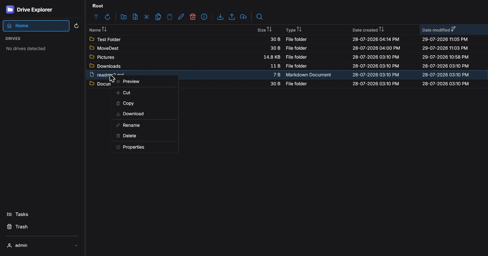 |
| **Multi-select** | 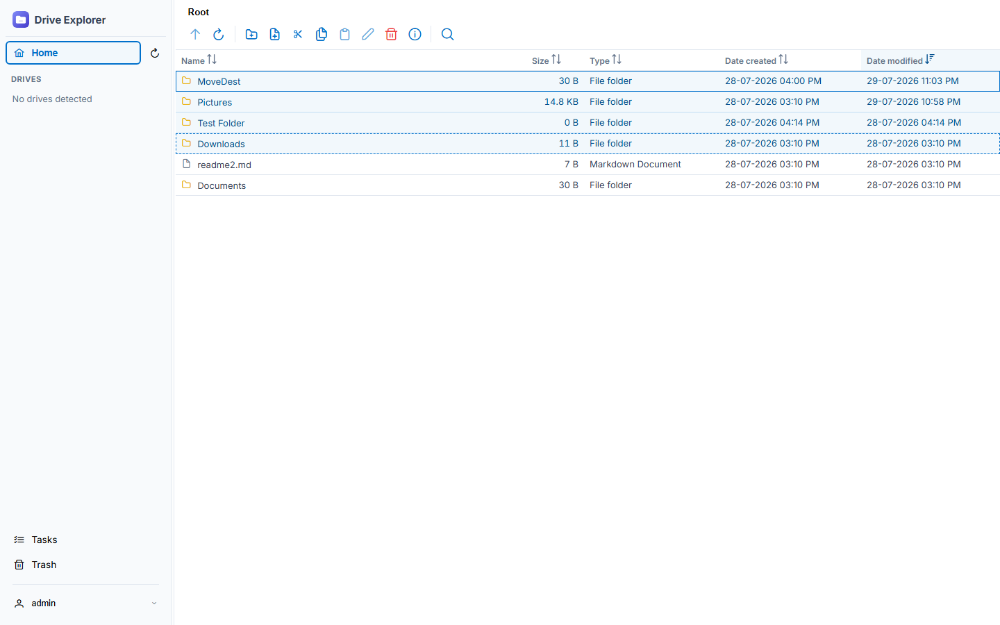 | 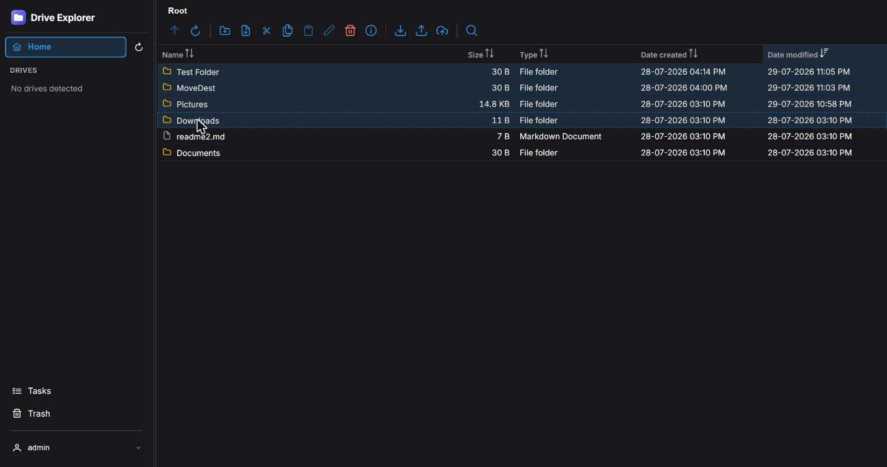 |
| **Properties → Permissions tab** | 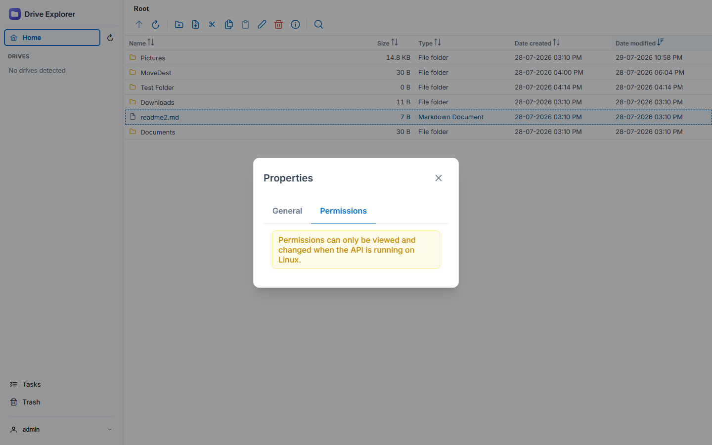 | 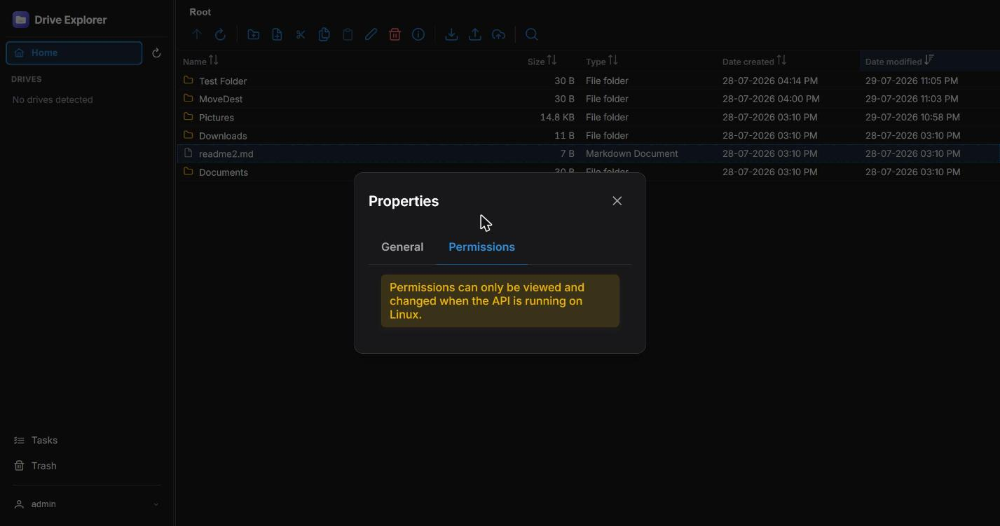 |
| **File preview** | 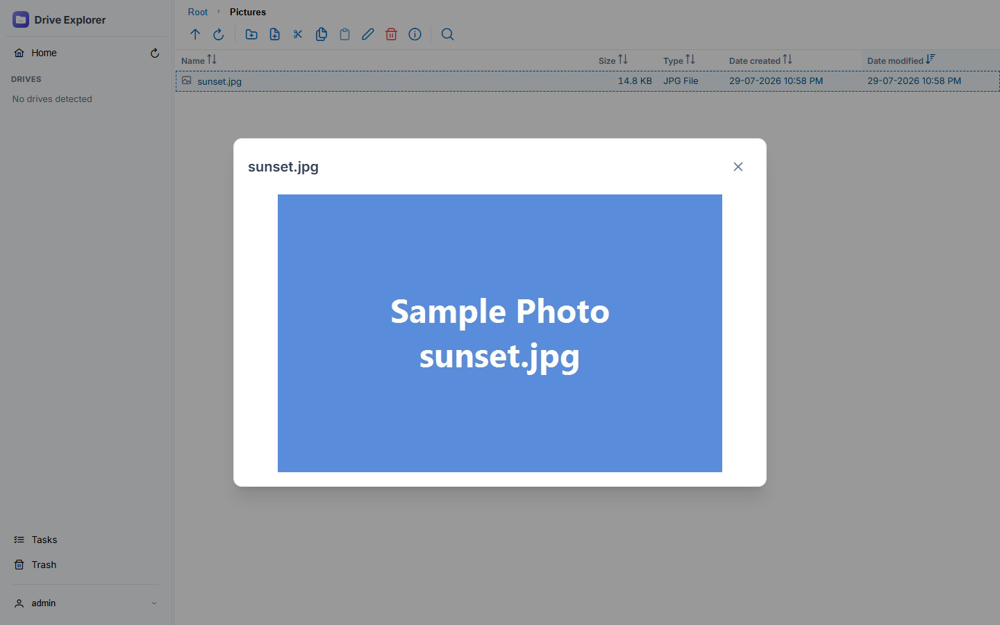 | 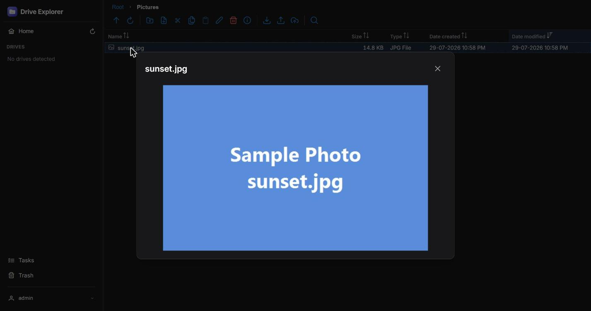 |
| **Background Tasks page** | 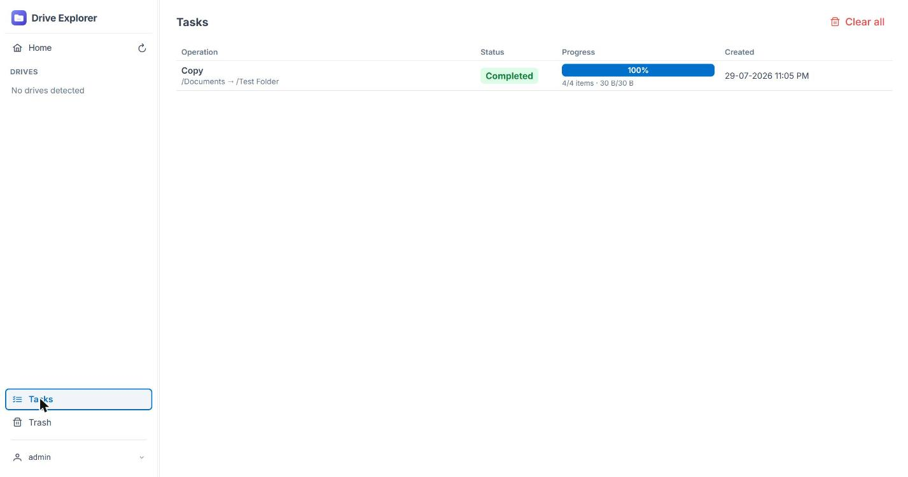 | 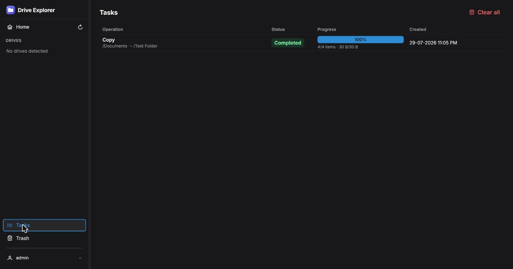 |
| **Trash page** | 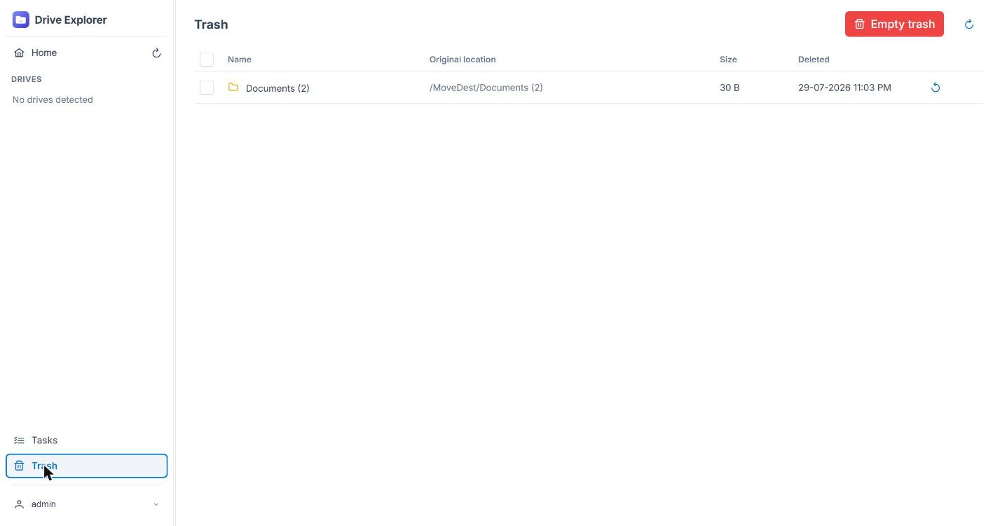 | 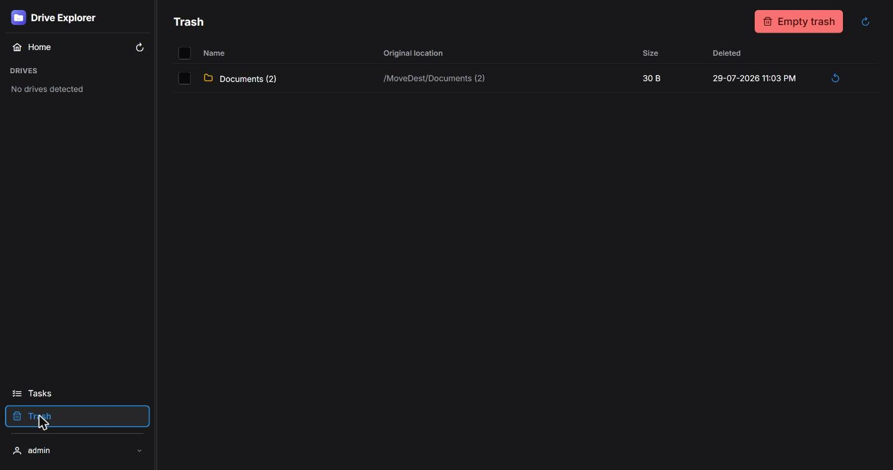 |
| **Recursive search** | 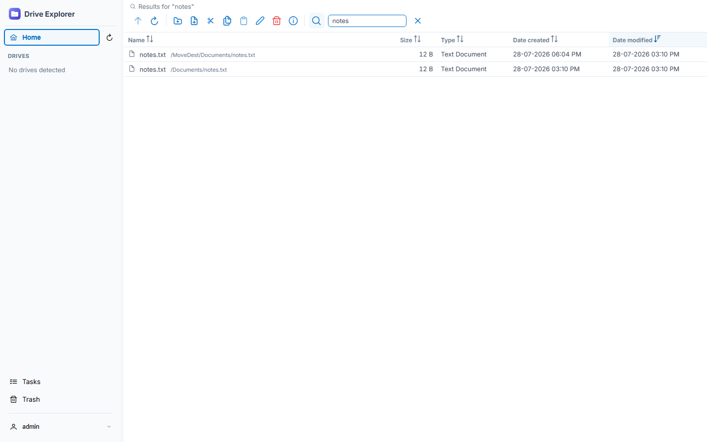 | 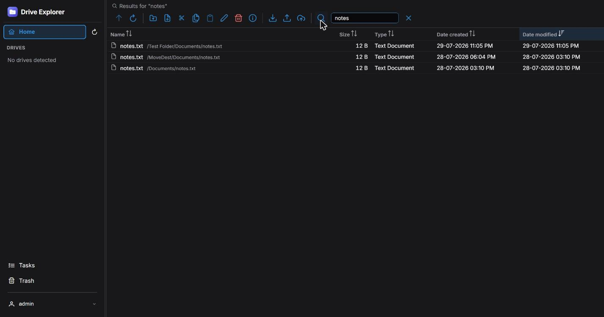 |

Screenshots above are from the local dev sandbox (`backend/.devroot`), which is why the
sidebar shows "No drives detected" and the Permissions tab shows its Linux-only notice —
the dev API runs on whatever OS you're developing on, not necessarily Linux.

## Architecture

```
backend/FileExplorer.Api/   ASP.NET Core 10 Web API, EF Core + SQLite, SignalR
frontend/                   Angular (standalone + signals) + PrimeNG, axios for HTTP
docker-compose.yml           two containers: api (Kestrel) + web (nginx serving the
                             built Angular app and reverse-proxying /api and /hubs)
```

The API treats one configured physical directory as its "root" (`FileSystem:RootPath`,
default `/host_root`) — every path the client sees is relative to that. In Docker, the
host's real `/` is bind-mounted there, so the API can reach anything the host can.

**This API is designed to run as root** so it can browse, chmod, and chown anywhere on
the host. Treat it accordingly: keep it off the public internet, put it behind a
trusted network/VPN, and always set a strong `JWT_KEY` and admin password (see below).

Mounting/unmounting removable drives from the UI goes a step further: the `api`
container runs `privileged: true` with `pid: host` (see `docker-compose.yml`) so it can
run `nsenter --target 1 ...` and execute `mount`/`umount` inside the *host's* own
namespaces — a mount issued from inside an unprivileged container's own namespace would
never be visible on the host. This gives the container full control over the host, on
top of already running as root, so the same network-isolation advice above applies even
more strongly. Mount/unmount is restricted server-side to devices under `/mnt` only.

## Quick start with Docker Compose

This is the recommended way to run the app. It builds two containers — `api` (the
.NET backend) and `web` (nginx serving the built Angular app and proxying `/api` and
`/hubs` to the API) — wired together by `docker-compose.yml`.

**Prerequisites:** Docker Engine + Docker Compose v2 (or Docker Desktop on
Windows/Mac).

### 1. Clone the repository

```bash
git clone https://github.com/pavangayakwad/linux-drive-explorer.git
cd linux-drive-explorer
```

### 2. Configure environment variables

Copy the example env file and fill in a strong JWT signing key:

```bash
cp .env.example .env
openssl rand -base64 48   # copy the output into JWT_KEY below
```

Edit `.env`:

```dotenv
# Required — 32+ random characters used to sign JWTs
JWT_KEY=<paste the generated value here>

# Optional — admin login. Leave ADMIN_PASSWORD blank to have a random
# password generated and printed once to the logs on first startup.
ADMIN_USERNAME=admin
ADMIN_PASSWORD=
```

### 3. Choose what the app can see

By default, `docker-compose.yml` bind-mounts the **entire host filesystem** (`/`) into
the `api` container at `/host_root` with `rslave` propagation, so every mount on the
host — including drives plugged in *after* the container starts — is browsable
automatically:

```yaml
services:
  api:
    volumes:
      - fx-data:/data
      - type: bind
        source: /                # host path — use "/" on Linux
        target: /host_root
        bind:
          propagation: rslave
```

If you'd rather expose only specific locations, replace that bind mount with a
narrower list instead, e.g.:

```yaml
volumes:
  - fx-data:/data
  - /home:/host_root/home
  - /mnt:/host_root/mnt
```

Whatever you mount, it must appear under `/host_root` inside the container (or update
`FileSystem__RootPath` to point at a different mount point).

### 4. Build and start the containers

```bash
docker compose up -d --build
```

This builds the `api` and `web` images and starts both containers in the background.

### 5. Open the app

Navigate to `http://<host>:8080` (the port `web` is published on in
`docker-compose.yml`).

If you left `ADMIN_PASSWORD` blank, fetch the generated password from the logs before
your first login:

```bash
docker compose logs api | grep -A2 "Password:"
```

### 6. Day-to-day operations

```bash
docker compose logs -f api      # tail API logs
docker compose logs -f web      # tail nginx logs
docker compose restart api      # restart just the API
docker compose down             # stop and remove containers (keeps volumes)
docker compose up -d --build    # rebuild after pulling new code
```

### HTTPS

The `web` container serves plain HTTP. For anything beyond a trusted LAN, put a
TLS-terminating reverse proxy (Caddy, Traefik, or nginx with a certificate) in front of
it rather than exposing the port directly to the internet.

## Keyboard navigation

The Explorer is fully operable from the keyboard once focus is inside the file
listing (click a row, or `Tab` into the grid, to give it focus).

### Selection & navigation

| Key | Action |
|---|---|
| `↑` / `↓` | Move focus to the previous/next row |
| `Shift` + `↑` / `↓` | Extend the current selection up or down |
| `Page Up` / `Page Down` | Jump focus to the first/last row |
| `Shift` + `Page Up` / `Page Down` | Extend the selection to the first/last row |
| `Ctrl` + `A` | Select every item in the current folder |
| `Escape` | Clear the current selection |
| Click | Select a single row |
| `Ctrl` / `Cmd` + Click | Toggle an individual row in/out of the selection |
| `Shift` + Click | Select a contiguous range from the last-clicked row |
| Click-drag on empty space | Rubber-band (lasso) select multiple rows |

### Opening & navigating folders

| Key | Action |
|---|---|
| `Enter` | Open the focused folder, or open/preview the focused file |
| `Backspace` / `Alt` + `↑` | Go up one folder level |

### File operations

| Key | Action |
|---|---|
| `Ctrl` + `C` | Copy the selected items |
| `Ctrl` + `X` | Cut the selected items |
| `Ctrl` + `V` | Paste into the current folder (runs as a background job) |
| `F2` | Rename the focused item |
| `Delete` | Move the selected items to Trash (with confirmation) |

Drag-and-drop also works with the mouse: drag files onto a folder to move them, or
hold `Ctrl` while dragging to copy instead.

Renaming or creating a new file/folder opens a small prompt dialog: `Enter` confirms
it, `Escape` cancels. The same goes for the delete confirmation dialog — `Enter` /
`Space` activates whichever button (Yes/No) has focus, so you never have to reach for
the mouse to confirm or back out of a destructive action.

### Instant search

Just start typing while the listing has focus — any printable character opens the
quick-search box and filters the current folder as you type, without needing to click
a search icon first. Press `Enter` in the search box to run the search immediately
instead of waiting for the debounce timer.

### Drives sidebar

| Key | Action |
|---|---|
| `Alt` + `1` | Jump focus straight to the drives panel (the active drive, or the first one) |
| `↑` / `↓` | Move focus between drives once the sidebar has focus |

## Local development (without Docker)

Requires the .NET 10 SDK and Node 22+.

```bash
# Terminal 1 — API (listens on http://localhost:5266, per Properties/launchSettings.json)
cd backend/FileExplorer.Api
dotnet run

# Terminal 2 — Angular dev server (proxies /api and /hubs to the API — see proxy.conf.json)
cd frontend
npm install
npm start
```

Open http://localhost:4200. In development, `FileSystem:RootPath` points at
`backend/.devroot` (a small sandbox folder, not your real filesystem) and the admin
login is `admin` / `admin123` — see `appsettings.Development.json`. This sandboxing is
intentional: local dev never touches your real files, and drives won't show up in the
sidebar unless `.devroot` happens to contain mount points of its own.

## Troubleshooting

### "Port is not available" on Windows (Docker Desktop)

Windows periodically reserves ranges of TCP ports for Hyper-V/WSL, which can make port
8080 (or others) fail to bind with a permissions-looking error even though nothing else
is using it. Check with:

```powershell
netsh interface ipv4 show excludedportrange protocol=tcp
```

If 8080 falls in a listed range, either restart Windows (ranges are reassigned on
reboot) or just map `web` to a different, free host port in `docker-compose.yml`
(e.g. `"9500:80"`).

## Project layout reference

- `backend/FileExplorer.Api/Controllers` — REST endpoints (auth, files, drives,
  operations, tasks, trash, permissions, search)
- `backend/FileExplorer.Api/Services/Jobs` — background job queue + worker that
  executes copy/move/delete/purge
- `frontend/src/app/features` — `shell` (sidebar/layout), `explorer`, `tasks`, `trash`,
  `login`
- `frontend/src/app/core` — axios client, auth/token handling, typed API services
